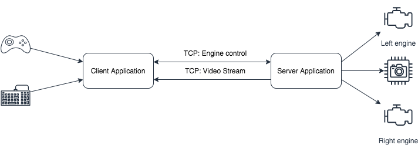

# RC.Machine is a client/server application to control Raspberry PI based robot

## Diagram



## Install the server

```console
make install
```

see https://github.com/minio/minio-service/tree/master/linux-systemd

## Build

### MacOS

Setup ARMv7 Toolchain for MacOS:

```console
brew install arm-linux-gnueabihf-binutils
rustup target add armv7-unknown-linux-musleabihf
```

### Install

Prepare environment on the remote machine

```console
sudo mkdir -p /opt/rc.machine
sudo chown rc-user /opt/rc.machine
```

